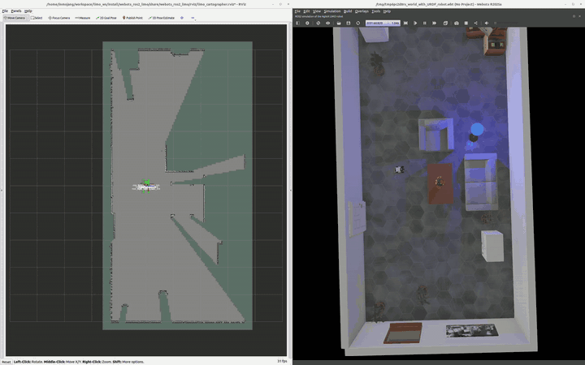
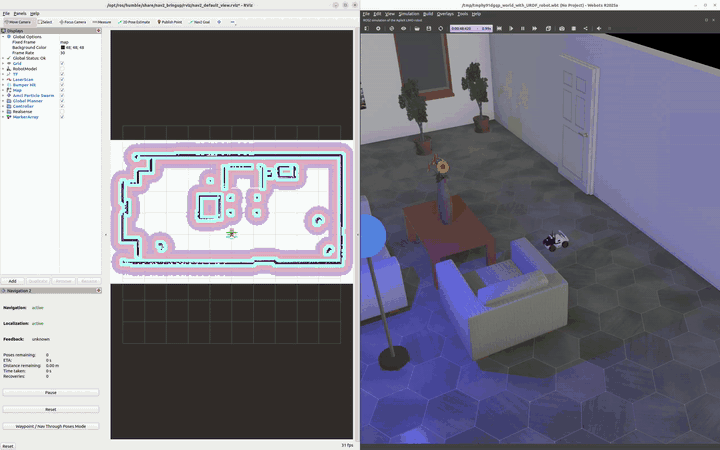
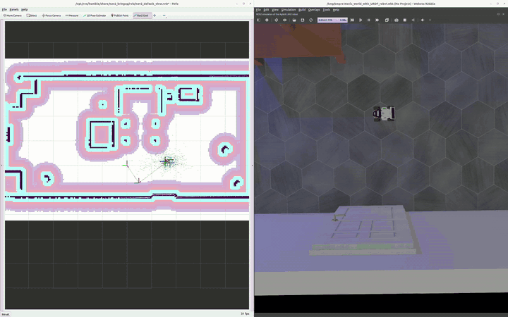

# webots_ros2_limo

AgileX **LIMO Pro** (four-wheel differential drive, or mecanum wheels) in
[Webots](https://cyberbotics.com), driven by `webots_ros2_driver` +
`ros2_control`, with cartographer SLAM and Nav2 navigation.

Tested on **Ubuntu 22.04 / ROS 2 Humble / Webots R2025a**.

---

## 1. Install Dependencies

```bash
sudo apt update
sudo apt install \
  ros-humble-webots-ros2 \
  ros-humble-ros2-control \
  ros-humble-ros2-controllers \
  ros-humble-teleop-twist-keyboard \
  ros-humble-cartographer-ros \
  ros-humble-nav2-bringup
```

Webots R2025a must be installed at `/usr/local/webots`
(or exported via `WEBOTS_HOME` / `ROS2_WEBOTS_HOME`).

## 2. Clone & Build

```bash
# in your ROS 2 workspace root (e.g. ~/my_ros2_ws)
git clone https://github.com/inmo-jang/webots_ros2_limo.git src/webots_ros2_limo
colcon build --packages-select webots_ros2_limo
source install/local_setup.bash
```

---

## 3. Run the Simulator

```bash
ros2 launch webots_ros2_limo robot_launch.py
```

This starts Webots with the LIMO robot, the `webots_ros2_driver`, the
`ros2_control` spawners and `robot_state_publisher`. `limo_odometry` publishes
`/odom` and the `odom -> base_link` TF, taking distance from the wheel encoders
and heading from the IMU.

Drive it with the keyboard:

```bash
ros2 run teleop_twist_keyboard teleop_twist_keyboard
```

`i` forward, `,` backward, `j`/`l` rotate, `u`/`o` forward + rotate.
`w`/`x` change linear speed, `e`/`c` angular.

### Launch arguments

| Argument | Default | Purpose |
|---|---|---|
| `drive` | `diff` | `diff` (four-wheel differential) or `mecanum` (omnidirectional, see step 6) |
| `world` | per `drive` | World file from `worlds/`: `limo_world.wbt` or `limo_world_mecanum.wbt` |
| `mode` | `realtime` | Webots startup mode (`realtime`, `fast`, `pause`) |
| `slam` | `false` | Also start SLAM + RViz in the same command |
| `nav` | `false` | Also start Nav2 + RViz in the same command |
| `map` | `resource/limo_world_map.yaml` | Map used when `nav:=true` |
| `use_sim_time` | `true` | Use the Webots `/clock` as ROS 2 time |

---

## 4. SLAM (cartographer)

Use **two terminals**. Source your workspace in each one.

**Terminal 1** — wait until Webots is open and the robot is standing in the
world before going on:

```bash
ros2 launch webots_ros2_limo robot_launch.py
```

**Terminal 2** — cartographer + RViz:

```bash
ros2 launch webots_ros2_limo cartographer_launch.py
```

Drive around with the keyboard teleop to build the map, then save it:

```bash
ros2 run nav2_map_server map_saver_cli -f limo_map
# Output in the current directory: limo_map.yaml, limo_map.pgm
```



| Argument | Default | Purpose |
|---|---|---|
| `use_rviz` | `true` | Open RViz with the SLAM view |
| `configuration_basename` | `limo_lds_2d.lua` | Cartographer lua config in `resource/` |
| `resolution` | `0.05` | Occupancy grid cell size [m] |
| `use_sim_time` | `true` | Use the Webots `/clock` as ROS 2 time |

---

## 5. Navigation (Nav2 + AMCL)

Again **two terminals**.

**Terminal 1** — wait until Webots is open before going on:

```bash
ros2 launch webots_ros2_limo robot_launch.py
```

**Terminal 2** — Nav2 + AMCL + RViz:

```bash
ros2 launch webots_ros2_limo nav2_launch.py
```

In RViz, click **2D Pose Estimate** to set the robot's initial pose, then
**Nav2 Goal** to send it somewhere. Or from the command line:

```bash
ros2 action send_goal /navigate_to_pose nav2_msgs/action/NavigateToPose \
  "{pose: {header: {frame_id: map}, pose: {position: {x: 1.1, y: -3.6}, orientation: {w: 1.0}}}}"
```



| Argument | Default | Purpose |
|---|---|---|
| `drive` | `diff` | Selects the default `params_file`; use the same value as in terminal 1 |
| `map` | `resource/limo_world_map.yaml` | Map yaml for AMCL to localise against |
| `params_file` | `resource/<drive>/nav2_params.yaml` | Nav2 parameter file |
| `use_rviz` | `true` | Open RViz with the Nav2 view |
| `use_sim_time` | `true` | Use the Webots `/clock` as ROS 2 time |

To navigate with your own map from step 4, run this from the directory where
you saved it:

```bash
ros2 launch webots_ros2_limo nav2_launch.py map:=limo_map.yaml
```

---

## 6. Mecanum Drive

With mecanum wheels the LIMO also moves sideways. Add `drive:=mecanum` to the
launch commands of steps 3-5; everything else stays the same.

```bash
ros2 launch webots_ros2_limo robot_launch.py drive:=mecanum
```

`/cmd_vel` then also takes `linear.y` (positive = left):

```bash
ros2 topic pub -r 20 /cmd_vel geometry_msgs/msg/Twist "{linear: {y: 0.1}}"
```

In `teleop_twist_keyboard`, hold **Shift** for sideways motion: `J`/`L` strafe
left/right, `U`/`O`/`M`/`>` move diagonally.

For navigation, start Nav2 with the same drive:

```bash
ros2 launch webots_ros2_limo nav2_launch.py drive:=mecanum
```

The robot keeps its heading while it drives and turns to the goal heading only
after it has arrived:



| | `drive:=diff` | `drive:=mecanum` |
|---|---|---|
| Robot model | `LimoFourDiff.proto` | `LimoMecanum.proto` |
| Controller | `diff_drive_controller` | `mecanum_drive_controller` |
| Nav2 controller | DWB | DWB, holonomic (keeps its heading while driving) |
| AMCL motion model | differential | omnidirectional |

The mecanum rollers are not modelled geometrically: as in the Webots KUKA youBot,
each wheel has an asymmetric contact friction rotated by ±45°, defined in
`worlds/limo_world_mecanum.wbt`.

---

## Sensors

Modelled after the real AgileX LIMO Pro:

| Sensor | Model | Sim configuration | Topics |
|---|---|---|---|
| 2D LiDAR | YDLIDAR T-mini Pro | 360°, 0.25–12 m, 667 pts/scan, 10 Hz | `/scan`, `/scan/point_cloud` |
| RGB Camera | Orbbec DaBai Astra Stereo S U3 | 960 × 540 @ 67.9° H | `/LIMO/rgb_camera/image_color`, `/LIMO/rgb_camera/camera_info` |
| Depth Camera | Orbbec DaBai Astra Stereo S U3 | 640 × 400 @ 67.9° H, 0.3–3 m | `/LIMO/depth_camera/image`, `/LIMO/depth_camera/point_cloud` |
| IMU | HiPNUC HI226 | `sensor_msgs/Imu`, 20 Hz | `/imu` |

`/scan` and `/imu` are remapped to those plain names in `resource/limo.urdf`;
the camera topics keep the driver's default `/<robot name>/<device>` form.
Cameras and point clouds are only sampled while something subscribes, so they
cost nothing when unused.

Robot control: `/cmd_vel` in (`linear.x`, `angular.z`; with `drive:=mecanum` also
`linear.y`), `/odom` and `odom -> base_link` TF out.

---

## Package Layout

```
webots_ros2_limo/
├── launch/
│   ├── robot_launch.py         # Webots + driver + ros2_control spawners
│   ├── cartographer_launch.py  # cartographer_ros nodes + RViz
│   └── nav2_launch.py          # nav2_bringup + RViz, with this package's map
├── protos/
│   ├── LimoFourDiff.proto      # AgileX LIMO robot model (4-wheel diff)
│   ├── LimoMecanum.proto       # same robot with mecanum wheels
│   └── meshes/                 # limo_base.dae, limo_wheel.dae
├── resource/
│   ├── limo.urdf               # sensor <device> blocks + IMU plugin + ros2_control
│   ├── limo_lds_2d.lua         # cartographer config
│   ├── limo_world_map.{yaml,pgm}
│   ├── diff/
│   │   ├── ros2control.yaml    # diff_drive_controller config
│   │   └── nav2_params.yaml    # Nav2 parameters (DWB)
│   └── mecanum/
│       ├── ros2control.yaml    # mecanum_drive_controller config
│       └── nav2_params.yaml    # Nav2 parameters (DWB, holonomic)
├── webots_ros2_limo/
│   └── limo_odometry.py        # /odom + odom->base_link TF from encoders + IMU
├── doc/
│   └── cartographer.gif, nav2.gif, mecanum.gif
├── rviz/
│   └── limo_cartographer.rviz  # SLAM view
└── worlds/
    ├── limo_world.wbt          # apartment world, LimoFourDiff
    └── limo_world_mecanum.wbt  # same world, LimoMecanum
```
